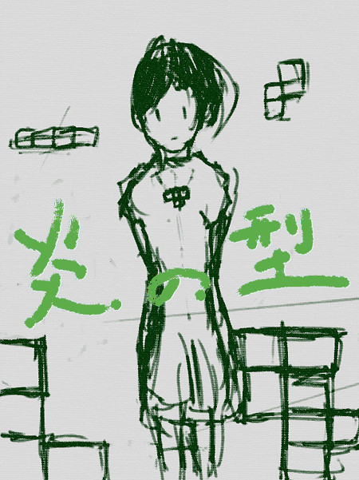

# About

本書では、Dartを利用して、様々なゲームを作成していきます。
世界初のビデオゲームである「Tennise for two」、世界初のシューティングゲームである「Spacewar!」。アーケードでビデオゲームの地位を確立した「Pong」などのチュートリアルが収録されています。

### ことはじめ
　本文書は、[「炎の型 With Scratch (ゲームプログラム入門)」](https://www.gitbook.com/book/kyorohiro/doc_scratch/details) を、Dartで書き直したものです。
 
##### Dartで、ゲームを完結に記述できるようなります。
 Dartで書くと100〜200行程度のテトリスのコードがあります。これをScratchでみると難解に見えます。たかだか、100行のコードでさえも、一画面に収まらないためです。
 
 また、Scratchには、関数、ローカル変数、クラスといった、簡潔に記述する仕組みが、一部存在していません。このため、そこそこ複雑なゲームを作成しようとするのは、とても大変です。

##### そして、世界が広がります。
 多少遠回りになねかも知れませんが、キーボードの使い方を覚え。Dart(プログラム言語)で記述できるようになれば、世界が一気に広がることでしょう。
 
 
 

### LICENSES
http://creativecommons.org/licenses/by/4.0/

この文書のライセンスはCC0で配布しています。だいだいの権利を放棄しています。

まるっとコピーしても良いです。改変して配布しても良いですし。有料で利用してもらっても良いです。これらの事がkyorohiroの断りなくできます。

 
 
